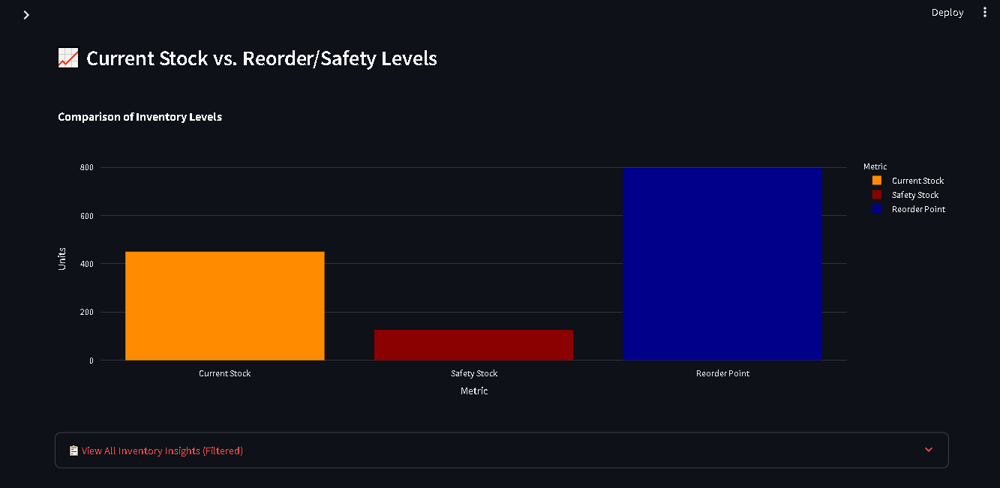

# Supply Chain Analytics Dashboard

---

## Project Overview

An interactive dashboard for analyzing supply chain operations through demand forecasting, inventory management, and supplier performance analysis.

The dashboard helps users explore historical demand, forecast future requirements, assess stock levels, and compare supplier performance. It uses simulated data to demonstrate the analytical workflow and dashboard functionality.

---

## Key Features

* **Demand Forecasting:** Visualize historical demand and forecast future requirements using time-series models, with forecast accuracy metrics.

* 

* **Inventory Management:** Monitor stock levels and calculate safety stock, reorder points, and reorder quantities.

* **Supplier Analytics:** Analyze supplier performance using indicators such as on-time delivery rates and average lead times.

* **Interactive Filters:** Explore results by product, location, supplier, and custom date ranges.

* 

---

## Technology Stack

* **Python:** Core programming and analysis
* **Pandas:** Data manipulation and analysis
* **Prophet:** Time-series forecasting
* **Streamlit:** Interactive dashboard development
* **Plotly:** Data visualization

---

## Developed by

**Aklilu Abera** | **Data Analyst**
